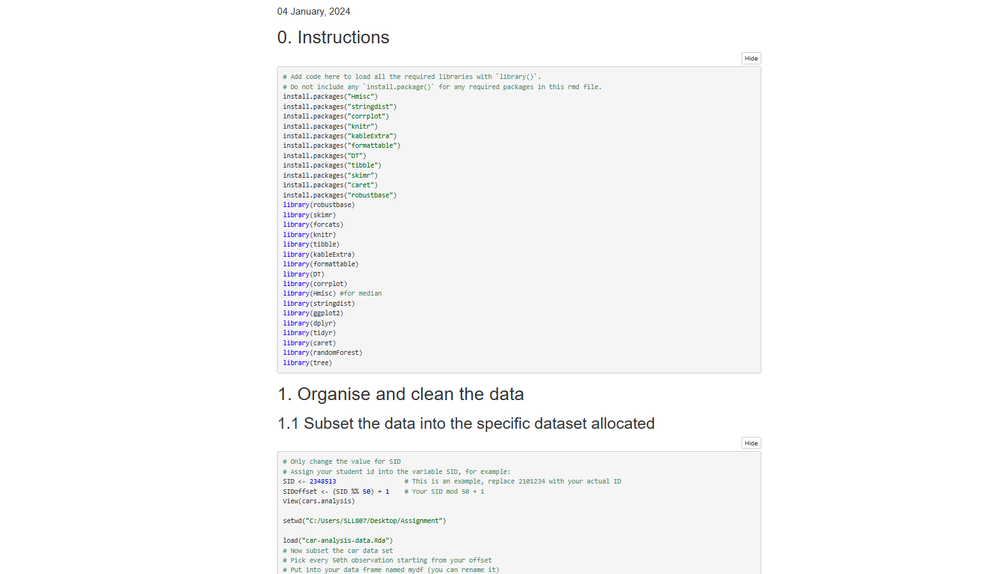

# Automobile Predictive Data Analysis

## Overview
This project presents a comprehensive data analysis and machine learning approach for predicting automobile prices based on various features. The analysis includes detailed exploration of factors such as make, model, ownership, and other relevant variables that influence vehicle pricing.

## Live Demo
View the interactive analysis and results at: [Automobile Price Prediction Analysis](https://zanjeel.github.io/Automobile-Predictive-Data-Analysis-RStudio/Automobile-Price-Prediction.nb.html)

## Technologies Used
- **R Programming Language**
- **RStudio IDE**
- **Machine Learning Libraries**
  - caret
  - randomForest
  - ggplot2
  - dplyr
  - tidyr

## Features
- Comprehensive data analysis of automobile prices
- Feature engineering and data preprocessing
- Multiple machine learning model implementations
- Interactive visualizations
- Price prediction based on various parameters
- Model performance evaluation and comparison

## Key Components
1. **Data Analysis**
   - Exploratory Data Analysis (EDA)
   - Feature correlation analysis
   - Statistical insights

2. **Machine Learning Models**
   - Random Forest
   - Linear Regression
   - Model comparison and evaluation

3. **Visualizations**
   - Price distribution analysis
   - Feature importance plots
   - Correlation matrices

## Getting Started
1. Clone the repository
2. Open the `Automobile-Price-Prediction.nb.html` file in a web browser
3. Explore the interactive analysis and results

## Results
The project provides insights into:
- Key factors affecting automobile prices
- Model performance metrics
- Prediction accuracy
- Feature importance rankings

## Author
Zanjeel

## License
This project is open source and available under the MIT License.
